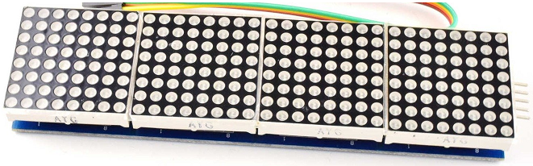
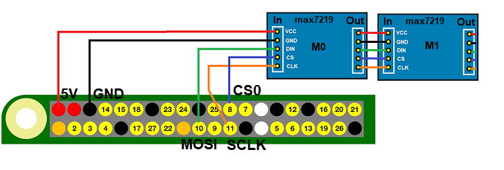

# node-red-contrib-iiot-rpi-max7219

[](https://nodered.org)
[](https://www.raspberrypi.com/)


[](https://www.paypal.com/cgi-bin/webscr?cmd=_s-xclick&hosted_button_id=ZDRCZBQFWV3A6)

A Node-Red node for max7219 8-Digit LED Display<br>

Example  **max7219** 7-Segment Module


Example  **max7219** Matrix Module


Connecting  **max7219** Module to SPI0-CS0


## Nodes
- **max7219-7seg**: Controls mx7219 7-Segment Modules.
- **max7219-mtx**: Controls mx7219 Matrix Modules.

## Installation
Install with Node-Red Palette Manager or npm command:
```
cd ~/.node-red
npm install node-red-contrib-iiot-rpi-max7219
```

## Usage
- Cascade modules in series.<br>
- If the modules are connected to the +5V RPi,<br>
  consider the total power consumption.<br>
- Use external voltage source on overload.<br>
- This node works on Raspberry Pi with 32bit or 64bit OS.
- Enable SPI with raspi-config.<br>
- For enable SPI1 read Rpi documentation.<br> 


[CHANGELOG](CHANGELOG.md)<br>