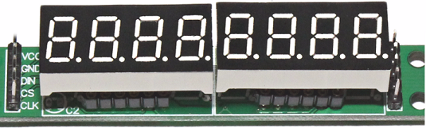

# node-red-contrib-iiot-rpi-max7219

[](https://nodered.org)
[](https://www.raspberrypi.com/)


[](https://www.paypal.com/cgi-bin/webscr?cmd=_s-xclick&hosted_button_id=ZDRCZBQFWV3A6)

A Node-Red node for max7219 8-Digit LED Display<br>

Example  **max7219** 7-Segment Module



Example  **max7219** Matrix Module


## Nodes
- **max7219-7seg**: Controls mx7219 7-Segment Modules.
- **max7219-mtx**: Controls mx7219 Matrix Modules.

## Installation
Install with Node-Red Palette Manager or npm command:
```
cd ~/.node-red
npm install node-red-contrib-iiot-rpi-max7219
```

## Usage

[How To Use](howtouse.md)<br>

## Changelog
[CHANGELOG](CHANGELOG.md)<br>