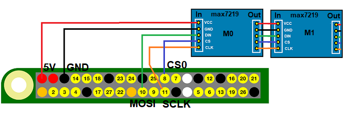

# node-red-contrib-iiot-rpi-max7219

## Connecting  **max7219** Module to SPI0-CS0



|SPI|CS|MOSI|SCLK|
|:----|:---|:---|:---|
|SP0-CS0|8|10|11|
|SP0-CS1|7|10|11|
|SP1-CS0|16|20|21|
|SP1-CS1|17|20|21|

- Cascade modules in series.<br>
- If the modules are connected to the +5V RPi,<br>
  consider the total power consumption.<br>
- Use external voltage source on overload.<br>
- Enable SPI0 with raspi-config.<br>
- For enable SPI1 read Rpi documentation.<br> 
- This node works on Raspberry Pi with 32bit or 64bit OS.

## Node **max7219-7seg** controls max7219 7-Segment modules

### **This 7-Segment LED module has 1 x max7219 chip**


Because the modules are connected in series, the node must know how many<br>
max7219 are connected on SPI bus.<br>
- Enter the number of max7219 in node configuration dialog<br>
at field ***Module-Count***.<br>
- Each node can address modules.<br>
- To select module, enter position number in ***Module-Pos***.<br>
- First module is 0 and so on.<br>

### Send data to Node:
- Whole digits are filled with ***Fill*** character<br>
and input text is written to module.<br>
- When **Rigth-Align** is selected, text is shift to rigth.<br>  
- Input Numbers are converted to string.<br> 
- Only ACII code characters "blank" (0x20) to ~ (0x7E) are displayed.<br>
- An exception to this is the degree sign ° and<br>
***0x00 - 0x1F*** for displays custom font.<br>
- Trailing point in string, turns LED point on.<br>
- More then valid 8 characters are cut.<br>

```javascript
msg.payload = 1234; // number
msg.payload = 3.14; // number with point
msg.payload = 25.3 + "°C"; // number + string
msg.payload = "test"; // string
```

Node properties can be changed on input message:
```javascript
msg.clear = true;  // clears all modules
msg.intens = 0;    // set to lowest led intensity
msg.npos = 3;      // address other module
msg.ralign = true; // set to rigth align
msg.fill = "x";    // fill with x
```
### Custom font

- Sends custom font as number array.
- Select with **topos** properties start point.
- Each array element defines 7-segment leds.
- Max. 32 custom fonts are possible.
- To delete custom fonts, send empty array.

```javascript
msg.customfont = [0x27, 0x56, 0x73]; // Custom font
msg.topos = 5;       // set custom font start at 5
msg.customfont = []; // delete all custom font
msg.payload = String.fromCharCode(0,1,2); // display custom font
```
 
|Segment|DP|A|B|C|D|E|F|G|
|:---|:---|:---|:---|:---|:---|:---|:---|:---
|**Bit-Pos**|**7**|**6**|**5**|**4**|**3**|**2**|**1**|**0**|

## Node **max7219-mtx** controls max7219 matrix modules
### **This Matrix LED module has 4 x max7219 chip**


Because the modules are connected in series, the node must know how many<br>
max7219 are connected on SPI bus.<br>
- Enter the number of max7219 in node configuration dialog<br>
at field ***Module-Count***.<br>
- Each node can address modules.<br>
- To select module, enter position number in ***Module-Pos***.<br>
- First module is 0 and so on.<br>

### Send data to Node:
- Only ACII code characters "blank" (0x20) to ~ (0x7E) are displayed.<br>
- An exception to this is<br>
***0xB0***: draws ° (alt+0176).<br>
***0xB1***: draws °C (alt+0177).<br>
***0xB2***: draws °F (alt+0178).<br>
***0x00 - 0x1F*** for displays custom font.<br>
- Data ist written starting at ***Module-Pos***.
- For display pattern, send number array.
- Selects fonts.<br>
<b>0</b>: Wide Font.<br>
<b>1</b>: Small Font.<br>
<b>2</b>: Small Font Compact.<br>
- On Small Font Compact following trailing<br>
characters are drawn within character:<br>
**. (Point)**<br>
**, (Comma)**<br>
**: (Colon)**<br>
**| (Line)**<br>
**' (Quote)**<br>
- This allows values to be represented more compactly.
- For example 3.753 is displayed on 4 led matrix.
- Input Numbers are converted to string.<br> 

```javascript
msg.payload = 1234; // number
msg.payload = 3.14; // number with point
msg.payload = 25.3 + String.fromCharCode(177);; // number + string
msg.payload = "test"; // string
msg.payload = [0x1C,0x22,0x55,0x41,0x55,0x49,0x22,0x1C]; // pattern array
```
Node properties can be changed on input message:
```javascript
msg.clear = true; // clears all modules
msg.intens = 0;   // set to lowest led intensity
msg.npos = 3;     // address other module
msg.nfont = 1;    // selects other font
```
### Pattern array definition


|Point|C1|C2|C3|C4|C5|C6|C7|C8|
|:---|:---|:---|:---|:---|:---|:---|:---|:---
|**Bit-Pos**|**7**|**6**|**5**|**4**|**3**|**2**|**1**|**0**|

```javascript
msg.payload = [R1,R2,R3,R4,R5,R6,R7,R8];
```
### Custom font

- Sends custom font as number array.
- The position is same as for pattern payload input. 
- Each array element defines line pattern.
- Eight array elements defines the font.
- Select with **topos** properties start point of font.
- Max. 32 custom fonts are possible.
- To delete custom fonts, send empty array.

```javascript
msg.customfont = [0x1C,0x22,0x55,0x41,0x55,0x49,0x22,0x1C]; // Custom font
msg.topos = 5;       // set custom font start at 5
msg.customfont = []; // delete all custom font
msg.payload = String.fromCharCode(0); // display custom font 0
```
